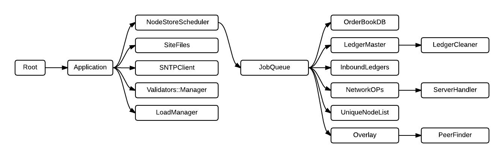

#Rippled dependencies




##Current observed order of shutdown:

```
RootStoppable::stop
RootStoppable::stopAsync
Stoppable::stopAsyncRecursive

call Application::OnStop
call LoadManager::OnStop
call Validators::Manager::OnStop
call SNTPClient::OnStop
call SiteFiles::OnStop
call NodeStoreScheduler::OnStop
call JobQueue::OnStop
call Overlay::OnStop
call PeerFinder::OnStop
call UniqueNodeList::OnStop
call NetworkOPs::OnStop
call ServerHandler::OnStop
call InboundLedgers::OnStop
call LedgerMaster::OnStop
call LedgerCleaner::OnStop

Stoppable::stopRecursive

wait for LoadManager::stopped()
wait for Validators::Manager::stopped()
wait for SNTPClient::stopped()
wait for SiteFiles::stopped()
wait for PeerFinder::stopped()
wait for Overlay::stopped()
wait for UniqueNodeList::stopped()
wait for ServerHandler::stopped()
wait for NetworkOPs::stopped()
wait for InboundLedgers::stopped()
wait for LedgerCleaner::stopped()
wait for LedgerMaster::stopped()
wait for OrderBookDB::stopped()
wait for JobQueue::stopped()
wait for NodeStoreScheduler::stopped()
wait for Application::stopped()
```

##Possibly correct order of shutdown given current dependency graph:

```
RootStoppable::stop
Stoppable::stopRecursive

call OrderBook::OnStop
wait for OrderBook::stopped() // Might not be running on the job queue!

call LedgerCleaner::OnStop
wait for LedgerCleaner::stopped()

call LedgerMaster::OnStop
wait for LedgerMaster::stopped()

call InboundLedgers::OnStop
wait for InboundLedgers::stopped()

call ServerHandler::OnStop
wait for ServerHandler::stopped()

call NetworkOPs::OnStop
wait for NetworkOPs::stopped()

call UniqueNodeList::OnStop
wait for UniqueNodeList::stopped()

call PeerFinder::OnStop
wait for PeerFinder::stopped()

call Overlay::OnStop
wait for call Overlay::stopped()

call JobQueue::OnStop
wait for JobQueue::stopped()

call NodeStoreScheduler::OnStop
wait for NodeStoreScheduler::stopped()

call SiteFiles::OnStop
wait for SiteFiles::stopped()

call SNTPClient::OnStop
wait for SNTPClient::stopped()

call Validators::Manager::OnStop
wait for Validators::Manager::stopped()

call LoadManager::OnStop
wait for LoadManager::stopped()

call Application::OnStop
wait for Application::stopped()

```

##Problems
* OnStop is called in the wrong order
* Wait for stopped() occurs in the wrong order
* After OnStop, no parent should receive OnStop until stopped() of current child is called.
* Fixing highlights problems in other parts of the code such as LedgerCleaner and OrderBookDB having possible cyclic dependencies and InboundLedgers should shutdown before LedgerMaster. Order of children matters!
* Dependency graph is possibly wrong.
* Jobs that run on the JobQueue such as OrderBookDB and possibly the path finding job will implicitly close when the Job Queue closes. There may be a need for multiple job queues. It gets complex quickly!
* Stoppable has too many features. It could have been called Preparable/Startable/Stoppable. It only ever runs on one thread, so its concurrency features, apart from checking stop() is called once only and condition variable usage, are unrequired.